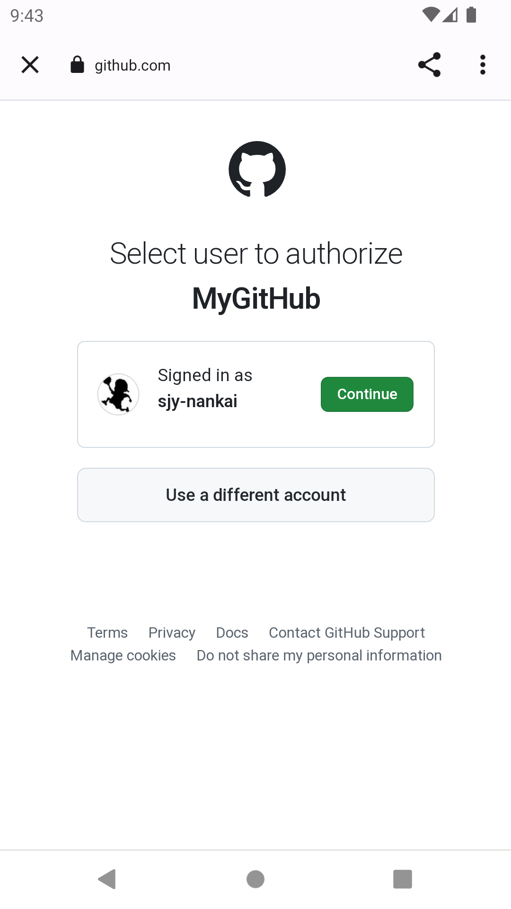
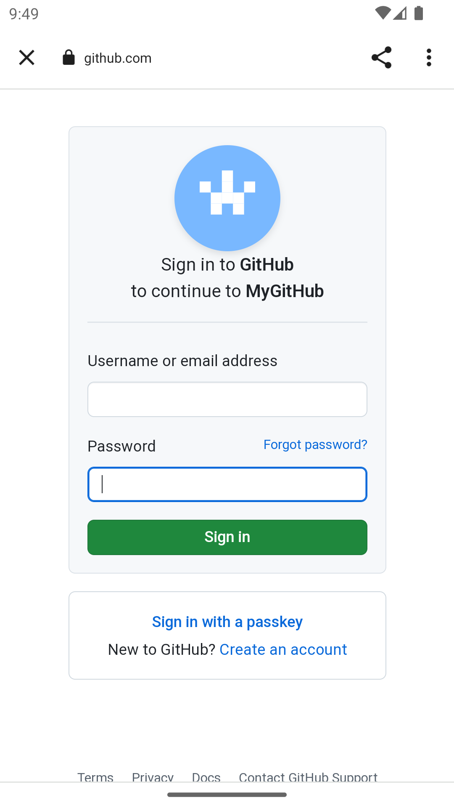
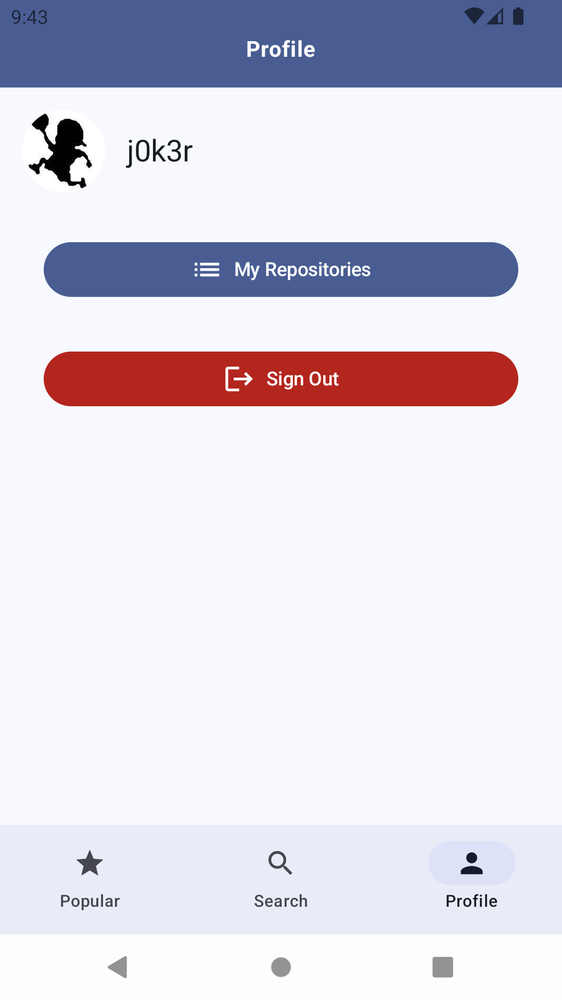

# MyGitHub

## This is customized Github client.

## Features:

1. Login: Since this is a third-party client, login can only be done via OAuth. The login and
   authorization pages are implemented through a browser, while other pages use Compose.The
   authentication status can survive even after relaunched.
2. Popular: The first page is the “Popular” page, which displays the most popular repositories.
3. Search: The search page allows for finding repositories in various programming languages.
4. Network module: The network layer code uses clean architecture.

> unimplemented feature: raise issue to repositories.

## UnitTest:

1. Implemented using Kotest and MockK.
2. Please install the plugin: kotest from the Marketplace for Kotest, then there will be button on
   the test file, otherwise you cannot test by ide, but you can still test by command line.

## Here are some screenshots:

